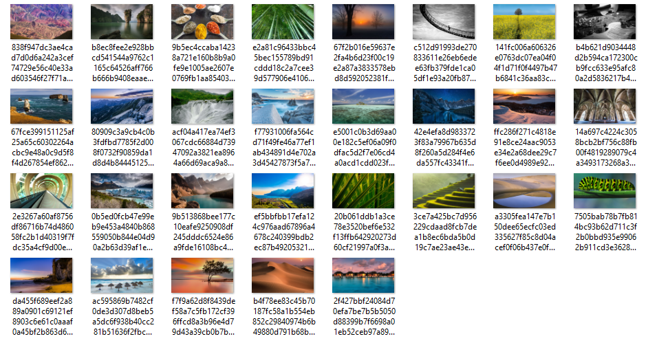

# Spotlight Images Revealed

"Windows 10 is keeping your lock screen sexy with its curated, personalized slideshow of images in Windows Spotlight". But where are these images and how to use them?

**Spotlight Images Revealed** is Windows 10 utility that collects these images and insert them in the folder `SpotlightImagesRevealed`, inside the user "Pictures" folder.

Written in python and built with [pyinstaller](http://www.pyinstaller.org/).

**NOTE**: I have no idea about the images license. I think that all the rights are reserverd to Microsoft.

## How to use it

Download the [**exe file**](https://github.com/aborruso/SpotlightImagesRevealed/releases/download/v0.1/slr.exe), run it and wait until the window is closed. Than you will have the images in `C:\Users\[username]\Pictures\SpotlightImagesRevealed` folder.

